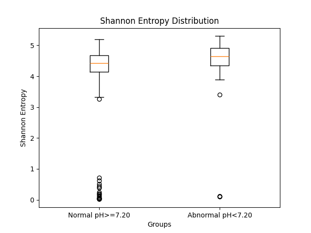

# fhr-signal-analysis
Biomedical signal analysis of fetal heart rate (FHR) data with statistical feature extraction and pH classification

## Overview
This project analyzes fetal heart rate (FHR) signals and investigates their relationship with neonatal pH levels. The goal is to identify statistical differences between normal and abnormal cases using signal-derived features.

## Dataset
The dataset is accessed via PhysioNet API using wfdb.

## Objectives
- Process fetal heart rate (FHR) signals  
- Extract meaningful statistical features  
- Compare normal and abnormal pH groups  
- Identify significant differences using statistical testing  

## Dataset
The dataset is obtained from PhysioNet (CTU-UHB CTG database).  
It contains fetal heart rate signals along with clinical information such as pH values.

## Methods
### Signal Processing
- Removal of invalid values and noise  
- Interpolation of missing signal segments  
- Filtering based on signal quality

### Feature Extraction
The following features were computed:
- Mean  
- Standard deviation  
- Skewness  
- Kurtosis  
- Root Mean Square (RMS)  
- Shannon Entropy

### Statistical Analysis
- Two-sample t-tests were applied  
- Comparison between:
  - Normal pH (≥ 7.20)  
  - Abnormal pH (< 7.20)  

## Tools & Technologies
- Python  
- NumPy  
- Pandas  
- SciPy  
- Matplotlib

## Shannon Entropy Comparison

  

Shannon entropy differs significantly between normal (pH ≥ 7.20) and abnormal (pH < 7.20) groups, indicating changes in signal complexity.

## Key Results
- Shannon Entropy was the only statistically significant feature  
- Traditional statistical features (mean, variance, skewness) were not significant  
- Entropy captures signal complexity beyond simple variability

## How to Run

1. Install required libraries:
   pip install numpy pandas scipy matplotlib

2. Run the script:
   python analysis.py
